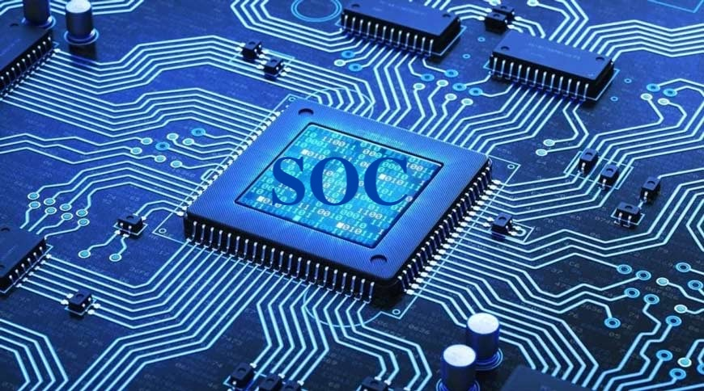

# System on Chip (SoC) Fundamentals

  

This repository provides a deep dive into the **fundamentals of System on Chip (SoC) design**, covering its definition, architecture, benefits, challenges, and the role of VLSI in modern electronics. Whether you're a student, hobbyist, or professional, this guide will help you understand the core concepts and latest trends in SoC and VLSI design.

---

## Table of Contents
- [What is a System on Chip (SoC)?](#what-is-a-system-on-chip-soc)
- [Why Do We Need SoC?](#why-do-we-need-soc)
- [Key Benefits of SoC](#key-benefits-of-soc)
- [SoC Architecture](#soc-architecture)
- [Current Challenges in SoC Design](#current-challenges-in-soc-design)
- [Role of VLSI in SoC Design](#role-of-vlsi-in-soc-design)
- [Latest Trends in SoC and VLSI (2025)](#latest-trends-in-soc-and-vlsi-2025)
- [Applications of SoC](#applications-of-soc)
- [Resources and Further Reading](#resources-and-further-reading)

---

## What is a System on Chip (SoC)?

A **System on Chip (SoC)** is an integrated circuit (IC) that integrates all components of a computer or electronic system into a single chip. This includes:
- Central Processing Unit (CPU)
- Memory (RAM, ROM)
- Input/Output (I/O) interfaces
- Graphics Processing Unit (GPU)
- Wireless connectivity (Wi-Fi, Bluetooth)
- Power management units
- Specialized accelerators (AI, DSP, etc.)

SoCs are the backbone of modern smart devices, enabling compact, efficient, and high-performance electronics.

---

## Why Do We Need SoC?

| Reason                | Explanation                                                                 |
|-----------------------|-----------------------------------------------------------------------------|
| Miniaturization       | Combines multiple functions into a single chip, reducing device size       |
| Power Efficiency       | Optimized for low power consumption, ideal for battery-operated devices    |
| Performance           | Faster data processing due to reduced communication latency                |
| Cost-Effectiveness    | Lower manufacturing and assembly costs compared to multi-chip systems      |
| Reliability           | Fewer interconnections mean higher reliability and fewer points of failure 

---

## Key Benefits of SoC

| Benefit               | Impact                                                                     |
|-----------------------|---------------------------------------------------------------------------|
| Reduced Size          | Enables smaller, portable devices (smartphones, wearables)                |
| Lower Power           | Extends battery life for IoT and mobile devices                           |
| Improved Performance  | Faster processing and real-time data handling                            |
| Cost Savings          | Lower production and assembly costs                                      |
| Integration           | Simplifies system design and reduces PCB complexity                      |
| Security              | Centralized security features and hardware-based protection               

---

## SoC Architecture

A typical SoC architecture includes:

| Component             | Function                                                                   |
|-----------------------|----------------------------------------------------------------------------|
| CPU Cores             | Execute instructions and manage system operations                        |
| Memory Units          | Store data and instructions (RAM, ROM, Flash)                            |
| I/O Interfaces        | Connect to external devices (USB, HDMI, Ethernet)                        |
| GPU                   | Handles graphics rendering and display output                            |
| DSP                   | Digital signal processing for audio, video, and communications            |
| Connectivity          | Wireless modules (Wi-Fi, Bluetooth, 5G)                                  |
| Power Management      | Regulates power consumption and battery life                              |
| Security Modules      | Hardware-based security (encryption, secure boot)                       

  

---

## Current Challenges in SoC Design

| Challenge                     | Explanation                                                                 |
|-------------------------------|-----------------------------------------------------------------------------|
| Design Complexity             | Integrating billions of transistors and diverse IP blocks                  |
| Power Management              | Balancing performance with power consumption                              |
| Heat Dissipation              | Managing thermal issues in high-performance chips                         |
| Security Vulnerabilities      | Protecting against hardware-level attacks                                  |
| Verification & Testing        | Ensuring correctness and reliability of complex designs                   |
| Cost of Development           | High NRE (Non-Recurring Engineering) costs for advanced nodes              |
| Scalability                   | Supporting future upgrades and new features                             

---

## Role of VLSI in SoC Design

**VLSI (Very Large Scale Integration)** is the technology that enables the creation of SoCs by integrating thousands to billions of transistors on a single chip. VLSI is crucial for:
- Achieving high levels of integration and miniaturization
- Reducing power consumption and improving performance
- Enabling the development of complex digital and analog circuits
- Supporting advanced fabrication processes (7nm, 5nm, and below)

---
## SOC Design Flow

  

The above image illustrates the comprehensive System on Chip (SoC) Design Flow, a multi-stage process for developing integrated circuits that combine various components of a computer system onto a single chip. The flow can be broadly categorized into Front-End Design, Software Development, and Physical Design (Back-End), culminating in manufacturing and post-silicon validation. 
SoC Design Flow Stages:

1. SoC Specification
  - The process begins by defining the intended functionality, performance goals, power constraints, and physical dimensions of the chip based on the target application. 

2. Architecture Design (Hardware/Software Partitioning)
  - A high-level architecture of the chip is developed, outlining the key functional blocks, their interconnections, and the partitioning of functions between hardware and software components. 

3. Software Development (Parallel Track)
  - High-Level Modeling: Abstract algorithmic descriptions of hardware components are created, often in languages like C or SystemC.
  - Software Development: The software components are developed in parallel with hardware design, including drivers, firmware, and application software.
  - HW/SW Co-simulation: Hardware and software components are simulated together to ensure they function correctly and verify the hardware/software interfaces.
  - Software Testing and Refinement: Rigorous testing and debugging of the software on virtual prototypes or emulation platforms ensure its correctness and compatibility with the hardware.
  - Final Code: The optimized and validated software code is prepared for integration with the hardware. 

4. Front-End Design
  - RTL Design: The architecture is translated into a Register Transfer Level (RTL) representation using Hardware Description Languages (HDLs) like Verilog or VHDL, describing the data flow and control logic.
  - Functional Simulation and Verification: Extensive simulations and verifications are performed on the RTL code to ensure functional correctness and identify design flaws.
  - RTL Synthesis and DFT: The RTL design is converted into a gate-level netlist, which is a description of the circuit in terms of logic gates and their interconnections. Design For Testability (DFT) logic is also inserted to facilitate post-fabrication testing.
  - Gate Level Netlist: The output of synthesis, a detailed description of the circuit using standard logic cells. 

5. Physical Design (Back-End)
  - Place and Route: Standard cells (logic gates) are placed on the chip, and interconnections (routing) between them are created to meet timing, power, and area constraints.
  - Timing Verification and Signoff: Static Timing Analysis (STA) is performed to verify that the design meets all timing requirements and constraints.
  - Physical Verification: Checks like Design Rule Check (DRC) and Layout Versus Schematic (LVS) are performed to ensure the physical layout adheres to manufacturing rules and matches the logical design.
  - Design GDSII: The final layout data in Graphic Data System II (GDSII) format, which is sent to the semiconductor foundry for fabrication. 

6. Manufacturing
  - The GDSII data is used to fabricate the physical chip on silicon wafers in a semiconductor foundry. 

7. Post-Silicon Validation and Integration
  - After manufacturing, the fabricated chips are tested and validated in a real-world environment to ensure they meet all functional and performance specifications. 

8. Mass Production
  - Once validated, the chips proceed to mass production to be integrated into target devices.

---
## Latest Trends in SoC and VLSI (2025)

| Trend                        | Impact                                                                     |
|------------------------------|---------------------------------------------------------------------------|
| AI & ML Integration          | On-chip AI accelerators for real-time processing                          |
| 3D Stacked Integration       | Higher density and performance using 3D IC stacking                       |
| Advanced Materials           | Use of graphene, carbon nanotubes for better electrical/thermal properties |
| Edge Computing                | SoCs optimized for real-time, low-latency processing at the edge         |
| Security-First Design         | Hardware-based security for IoT and connected devices                    |
| Open-Source RISC-V           | Customizable, royalty-free CPU cores for diverse applications            

---

## Applications of SoC

| Industry          | Example Applications                                              |
|-------------------|-------------------------------------------------------------------|
| Mobile            | Smartphones, tablets, smartwatches                                |
| Automotive        | Advanced Driver Assistance Systems (ADAS), infotainment         |
| Healthcare        | Portable medical devices, wearables                              |
| IoT              | Smart home devices, industrial sensors                           |
| Consumer Electronics | Smart TVs, gaming consoles, digital cameras                     |
| Telecommunications | 5G modems, network routers                                      

---
## Acknowledgement 👑
I am thankful to [**Kunal Ghosh**](https://github.com/kunalg123) and Team **[VLSI System Design (VSD)](https://vsdiat.vlsisystemdesign.com/)** for the opportunity to participate in the ongoing **RISC-V SoC Tapeout Program**.  

I also acknowledge the support of **RISC-V International**, **India Semiconductor Mission (ISM)**, **VLSI Society of India (VSI)**, and [**Efabless**](https://github.com/efabless) for making this initiative possible.  

**Let’s build the future of electronics together!** If you have questions or want to discuss SoC/VLSI design, open an issue or start a discussion.

---