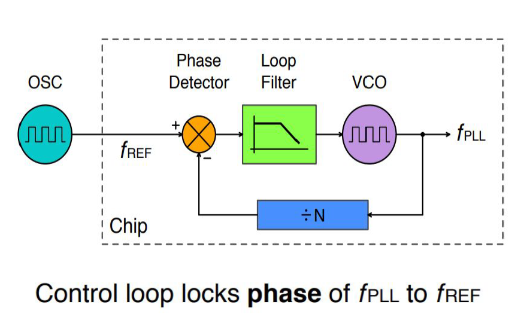

# System on Chip (SoC) Fundamentals

<div>
  
</div>


This repository provides a deep dive into the **fundamentals of System on Chip (SoC) design**, covering its definition, architecture, benefits, challenges, and the role of VLSI in modern electronics. Whether you're a student, hobbyist, or professional, this guide will help you understand the core concepts and latest trends in SoC and VLSI design.

---

## Table of Contents
- [What is a System on Chip (SoC)?](#what-is-a-system-on-chip-soc)
- [Why Do We Need SoC?](#why-do-we-need-soc)
- [Key Benefits of SoC](#key-benefits-of-soc)
- [SoC Architecture](#soc-architecture)
- [Current Challenges in SoC Design](#current-challenges-in-soc-design)
- [Role of VLSI in SoC Design](#role-of-vlsi-in-soc-design)
- [Latest Trends in SoC and VLSI (2025)](#latest-trends-in-soc-and-vlsi-2025)
- [Applications of SoC](#applications-of-soc)
- [VSDBabySoC](#vsdbabysoc-a-compact-risc-v-soc-for-learning-and-experimentation)

---

## What is a System on Chip (SoC)?

A **System on Chip (SoC)** is an integrated circuit (IC) that integrates all components of a computer or electronic system into a single chip. This includes:
- Central Processing Unit (CPU)
- Memory (RAM, ROM)
- Input/Output (I/O) interfaces
- Graphics Processing Unit (GPU)
- Wireless connectivity (Wi-Fi, Bluetooth)
- Power management units
- Specialized accelerators (AI, DSP, etc.)

SoCs are the backbone of modern smart devices, enabling compact, efficient, and high-performance electronics.

---

## Why Do We Need SoC?

| Reason                | Explanation                                                                 |
|-----------------------|-----------------------------------------------------------------------------|
| Miniaturization       | Combines multiple functions into a single chip, reducing device size       |
| Power Efficiency       | Optimized for low power consumption, ideal for battery-operated devices    |
| Performance           | Faster data processing due to reduced communication latency                |
| Cost-Effectiveness    | Lower manufacturing and assembly costs compared to multi-chip systems      |
| Reliability           | Fewer interconnections mean higher reliability and fewer points of failure 

---

## Key Benefits of SoC

| Benefit               | Impact                                                                     |
|-----------------------|---------------------------------------------------------------------------|
| Reduced Size          | Enables smaller, portable devices (smartphones, wearables)                |
| Lower Power           | Extends battery life for IoT and mobile devices                           |
| Improved Performance  | Faster processing and real-time data handling                            |
| Cost Savings          | Lower production and assembly costs                                      |
| Integration           | Simplifies system design and reduces PCB complexity                      |
| Security              | Centralized security features and hardware-based protection               

---

## SoC Architecture

A typical SoC architecture includes:

| Component             | Function                                                                   |
|-----------------------|----------------------------------------------------------------------------|
| CPU Cores             | Execute instructions and manage system operations                        |
| Memory Units          | Store data and instructions (RAM, ROM, Flash)                            |
| I/O Interfaces        | Connect to external devices (USB, HDMI, Ethernet)                        |
| GPU                   | Handles graphics rendering and display output                            |
| DSP                   | Digital signal processing for audio, video, and communications            |
| Connectivity          | Wireless modules (Wi-Fi, Bluetooth, 5G)                                  |
| Power Management      | Regulates power consumption and battery life                              |
| Security Modules      | Hardware-based security (encryption, secure boot)                       

<div>
  
</div>


---

## Current Challenges in SoC Design

| Challenge                     | Explanation                                                                 |
|-------------------------------|-----------------------------------------------------------------------------|
| Design Complexity             | Integrating billions of transistors and diverse IP blocks                  |
| Power Management              | Balancing performance with power consumption                              |
| Heat Dissipation              | Managing thermal issues in high-performance chips                         |
| Security Vulnerabilities      | Protecting against hardware-level attacks                                  |
| Verification & Testing        | Ensuring correctness and reliability of complex designs                   |
| Cost of Development           | High NRE (Non-Recurring Engineering) costs for advanced nodes              |
| Scalability                   | Supporting future upgrades and new features                             

---

## Role of VLSI in SoC Design

**VLSI (Very Large Scale Integration)** is the technology that enables the creation of SoCs by integrating thousands to billions of transistors on a single chip. VLSI is crucial for:
- Achieving high levels of integration and miniaturization
- Reducing power consumption and improving performance
- Enabling the development of complex digital and analog circuits
- Supporting advanced fabrication processes (7nm, 5nm, and below)

---
## SOC Design Flow

<div>
  
</div>

The above image illustrates the comprehensive System on Chip (SoC) Design Flow, a multi-stage process for developing integrated circuits that combine various components of a computer system onto a single chip. The flow can be broadly categorized into Front-End Design, Software Development, and Physical Design (Back-End), culminating in manufacturing and post-silicon validation. 
SoC Design Flow Stages:

1. SoC Specification
  - The process begins by defining the intended functionality, performance goals, power constraints, and physical dimensions of the chip based on the target application. 

2. Architecture Design (Hardware/Software Partitioning)
  - A high-level architecture of the chip is developed, outlining the key functional blocks, their interconnections, and the partitioning of functions between hardware and software components. 

3. Software Development (Parallel Track)
  - High-Level Modeling: Abstract algorithmic descriptions of hardware components are created, often in languages like C or SystemC.
  - Software Development: The software components are developed in parallel with hardware design, including drivers, firmware, and application software.
  - HW/SW Co-simulation: Hardware and software components are simulated together to ensure they function correctly and verify the hardware/software interfaces.
  - Software Testing and Refinement: Rigorous testing and debugging of the software on virtual prototypes or emulation platforms ensure its correctness and compatibility with the hardware.
  - Final Code: The optimized and validated software code is prepared for integration with the hardware. 

4. Front-End Design
  - RTL Design: The architecture is translated into a Register Transfer Level (RTL) representation using Hardware Description Languages (HDLs) like Verilog or VHDL, describing the data flow and control logic.
  - Functional Simulation and Verification: Extensive simulations and verifications are performed on the RTL code to ensure functional correctness and identify design flaws.
  - RTL Synthesis and DFT: The RTL design is converted into a gate-level netlist, which is a description of the circuit in terms of logic gates and their interconnections. Design For Testability (DFT) logic is also inserted to facilitate post-fabrication testing.
  - Gate Level Netlist: The output of synthesis, a detailed description of the circuit using standard logic cells. 

5. Physical Design (Back-End)
  - Place and Route: Standard cells (logic gates) are placed on the chip, and interconnections (routing) between them are created to meet timing, power, and area constraints.
  - Timing Verification and Signoff: Static Timing Analysis (STA) is performed to verify that the design meets all timing requirements and constraints.
  - Physical Verification: Checks like Design Rule Check (DRC) and Layout Versus Schematic (LVS) are performed to ensure the physical layout adheres to manufacturing rules and matches the logical design.
  - Design GDSII: The final layout data in Graphic Data System II (GDSII) format, which is sent to the semiconductor foundry for fabrication. 

6. Manufacturing
  - The GDSII data is used to fabricate the physical chip on silicon wafers in a semiconductor foundry. 

7. Post-Silicon Validation and Integration
  - After manufacturing, the fabricated chips are tested and validated in a real-world environment to ensure they meet all functional and performance specifications. 

8. Mass Production
  - Once validated, the chips proceed to mass production to be integrated into target devices.

---
## Latest Trends in SoC and VLSI (2025)

| Trend                        | Impact                                                                     |
|------------------------------|---------------------------------------------------------------------------|
| AI & ML Integration          | On-chip AI accelerators for real-time processing                          |
| 3D Stacked Integration       | Higher density and performance using 3D IC stacking                       |
| Advanced Materials           | Use of graphene, carbon nanotubes for better electrical/thermal properties |
| Edge Computing                | SoCs optimized for real-time, low-latency processing at the edge         |
| Security-First Design         | Hardware-based security for IoT and connected devices                    |
| Open-Source RISC-V           | Customizable, royalty-free CPU cores for diverse applications            

---

## Applications of SoC

| Industry          | Example Applications                                              |
|-------------------|-------------------------------------------------------------------|
| Mobile            | Smartphones, tablets, smartwatches                                |
| Automotive        | Advanced Driver Assistance Systems (ADAS), infotainment         |
| Healthcare        | Portable medical devices, wearables                              |
| IoT              | Smart home devices, industrial sensors                           |
| Consumer Electronics | Smart TVs, gaming consoles, digital cameras                     |
| Telecommunications | 5G modems, network routers                                      

---
# VSDBabySoC: A Compact RISC-V SoC for Learning and Experimentation

**VSDBabySoC** is a small-scale, open-source **System on Chip (SoC)** built around the **RISC-V** architecture. Designed for educational and experimental purposes, it enables simultaneous testing of three open-source IP cores and calibration of analog components.

---

## Table of Contents
- [Overview](#overview)
- [Key Features](#key-features)
- [SoC Architecture](#soc-architecture)
- [Components](#components)
  - [RVMYTH: The RISC-V CPU](#rvmyth-the-risc-v-cpu)
  - [PLL: Phase-Locked Loop](#pll-phase-locked-loop)
  - [DAC: Digital-to-Analog Converter](#dac-digital-to-analog-converter)
- [How It Works](#how-it-works)
  - [Initialization and Clock Generation](#initialization-and-clock-generation)
  - [Data Processing in RVMYTH](#data-processing-in-rvmyth)
  - [Analog Signal Generation via DAC](#analog-signal-generation-via-dac)
- [Why Use a PLL?](#why-use-a-pll)
- [DAC: Digital to Analog Conversion](#dac-digital-to-analog-conversion)
- [Applications](#applications)
- [Getting Started](#getting-started)

---

# VSDBabySoC
VSDBabySoC is designed to bridge the gap between digital and analog domains, making it an ideal platform for learning about SoC design, CPU architecture, clock synchronization, and analog signal generation. It integrates a RISC-V CPU, a PLL for clock generation, and a DAC for analog output, all on a single chip.

---

## Key Features

| Feature                | Description                                                                 |
|------------------------|-----------------------------------------------------------------------------|
| **RISC-V CPU (RVMYTH)**| Open-source, customizable CPU core for processing tasks.                   |
| **8x PLL**             | Generates stable, synchronized clock signals for the SoC.                  |
| **10-bit DAC**         | Converts digital data to analog signals for real-world applications.       |
| **Open-Source**        | All components and designs are open for modification and experimentation.  |
| **Educational Focus**  | Ideal for learning SoC design, CPU architecture, and analog/digital conversion. |

---

## SoC Architecture
The VSDBabySoC architecture is modular, with each component playing a specific role:

<div>
  
</div>

## Components

### RVMYTH: The RISC-V CPU
- **Role:** Acts as the brain of the SoC, executing instructions and managing data flow.
- **Features:**
  - Open-source RISC-V ISA implementation.
  - Customizable and extensible for educational purposes.
  - Communicates with the DAC via the `r17` register.
- **Use Case:** Ideal for learning CPU architecture, assembly programming, and SoC integration.

### PLL: Phase-Locked Loop
- **Role:** Generates a stable, synchronized clock signal for the SoC.
- **Features:**
  - Locks onto a reference frequency and minimizes jitter.
  - Ensures all components operate in harmony.
  - Can multiply or divide frequencies as needed.
- **Block Diagram:**

<div align="center" >
  
</div>

- **Components:**
  - **Phase Detector:** Compares input and output signals, generating an error signal.
  - **Loop Filter:** Processes the error signal to produce a control voltage.
  - **VCO (Voltage-Controlled Oscillator):** Adjusts frequency based on the control voltage.

### DAC: Digital-to-Analog Converter
- **Role:** Converts digital data from the CPU into analog signals.
- **Features:**
  - 10-bit resolution for high-quality output.
  - Outputs analog signals to external devices (e.g., speakers, displays).
  - Supports real-world applications like audio/video generation.
- **Types of DACs:**
  - **Weighted Resistor DAC:** Uses resistors of different values for each bit.
  - **R-2R Ladder DAC:** Uses a network of resistors for simpler design and scaling.

### **1. Binary Weighted Resistor DAC**

#### **Overview**
The **Binary Weighted Resistor DAC** converts a digital input (binary code) into an analog voltage output using resistors whose values are weighted in powers of two. Each bit of the digital input controls a switch that connects the corresponding resistor to a reference voltage or ground.

#### **Circuit Diagram**

<div align="center" >
  
</div>

#### **Working Principle**
- Each bit of the digital input is connected to a resistor whose value is twice that of the next lower bit.
- The most significant bit (MSB) uses the smallest resistor, and the least significant bit (LSB) uses the largest.
- The output voltage is the sum of the voltages contributed by each bit, weighted by the resistor values.

#### **Advantages**
- Simple and easy to understand.
- Fast conversion due to direct resistor network.

#### **Disadvantages**
- Requires a wide range of resistor values, which can be impractical for high-resolution DACs.
- More expensive and less scalable for higher bit counts.

---

### **2. R-2R Ladder DAC**

#### **Overview**
The **R-2R Ladder DAC** is a popular type of DAC that uses only two resistor values (R and 2R) arranged in a ladder network. This design simplifies the circuit and makes it easier to scale for higher resolutions.

#### **Circuit Diagram**

<div align="center" >
  
</div>

#### **Working Principle**
- The ladder network is constructed using resistors of values R and 2R.
- Each bit of the digital input controls a switch that connects the corresponding node to either the reference voltage or ground.
- The equivalent resistance seen by each node is always 2R, regardless of the number of bits, due to the ladder’s recursive structure.
- The output voltage is the sum of the voltages contributed by each bit, weighted by the ladder network.

#### **Advantages**
- Uses only two resistor values, making it easier and cheaper to manufacture.
- Highly scalable for higher bit counts.
- More practical for integrated circuit implementation.

#### **Disadvantages**
- Slightly more complex to analyze and design compared to the binary weighted DAC.
- Requires precise resistor matching for accurate conversion.

#### **Formula**
The output voltage `V_out` is given by:

`V_out = -V_ref * (b0/2^1 + b1/2^2 + b2/2^3 + ... + b(n-1)/2^n)`

where:
- `V_ref` is the reference voltage,
- `b0, b1, ..., b(n-1)` are the bits of the digital input (0 or 1),
- `n` is the number of bits.

---

### **Comparison Table**

| Feature                     | Binary Weighted Resistor DAC       | R-2R Ladder DAC                     |
|-----------------------------|------------------------------------|-------------------------------------|
| **Resistor Values**         | Many different values (2^0R, 2^1R, ...) | Only two values (R and 2R)         |
| **Scalability**             | Poor for high bit counts           | Excellent for high bit counts       |
| **Cost**                    | Higher (more resistor types)       | Lower (only two resistor types)     |
| **Complexity**              | Simple                             | Moderate                            |
| **Speed**                   | Fast                               | Fast                                |
| **Practicality for ICs**    | Less practical                     | Highly practical                    |

---

### **Why R-2R Ladder DAC is Used in VSDBabySoC**
- **Simplicity:** Only two resistor values are needed, simplifying the design and reducing cost.
- **Scalability:** Easily extended to higher resolutions (e.g., 10-bit DAC in VSDBabySoC).
- **Integration:** Well-suited for implementation in integrated circuits and FPGAs.

---
## How VSD Baby SOC Works

### Initialization and Clock Generation
1. On power-up, the PLL is activated.
2. The PLL locks onto the reference clock and generates a stable, synchronized clock signal.
3. This clock signal is distributed to the RVMYTH CPU and DAC, ensuring all components operate in sync.

### Data Processing in RVMYTH
1. The RVMYTH CPU executes instructions and processes data.
2. The `r17` register is used to hold and cycle through values destined for the DAC.
3. As the CPU runs, it updates `r17` with new data, preparing it for analog conversion.

### Analog Signal Generation via DAC
1. The DAC receives digital values from the RVMYTH CPU.
2. It converts these values into an analog signal.
3. The analog output is saved to a file (`OUT`) and can be sent to external devices (e.g., TVs, mobile phones) for further processing or display.

---

## Why Use a PLL?

| Issue                     | Impact                                                                 |
|---------------------------|------------------------------------------------------------------------|
| **Clock Distribution Delays** | Long wiring can introduce delays, affecting timing.                   |
| **Clock Jitter**          | Variations in signal timing can disrupt synchronization.               |
| **Different Frequency Needs** | Different SoC blocks may require different clock frequencies.       |
| **Crystal Frequency Errors** | Crystals can drift with temperature and age, affecting accuracy.      |
| **Frequency Stability**   | Higher ppm errors mean more frequency variation with temperature.     |

**Solution:** The PLL provides a stable, adjustable clock signal, ensuring reliable operation across the SoC.

---

## DAC: Digital to Analog Conversion
- **Digital Signal Representation:** Input is a binary code (1s and 0s).
- **Structure:** Multiple binary inputs, single analog output.
- **In VSDBabySoC:** 10-bit DAC allows for 1024 possible output values, enabling smooth analog signals.

---

## Applications
- **Education:** Learn SoC design, CPU architecture, and analog/digital conversion.
- **Prototyping:** Test and calibrate open-source IP cores.
- **Multimedia:** Generate analog signals for audio/video applications.
- **Embedded Systems:** Interface with analog sensors and actuators.

---

## Getting Started
1. **Clone the Repository:**
   ```bash
   git clone https://github.com/your-repo/VSDBabySoC.git
   ```

---
## Acknowledgement 👑
I am thankful to [**Kunal Ghosh**](https://github.com/kunalg123) and Team **[VLSI System Design (VSD)](https://vsdiat.vlsisystemdesign.com/)** for the opportunity to participate in the ongoing **RISC-V SoC Tapeout Program**.  

I also acknowledge the support of **RISC-V International**, **India Semiconductor Mission (ISM)**, **VLSI Society of India (VSI)**, and [**Efabless**](https://github.com/efabless) for making this initiative possible.  

**Let’s build the future of electronics together!** If you have questions or want to discuss SoC/VLSI design, open an issue or start a discussion.

---